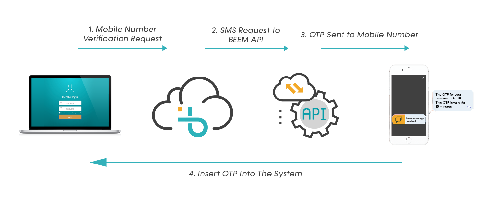

# OTP

import Tabs from '@theme/Tabs';
import TabItem from '@theme/TabItem';


The Beem OTP API has been developed to provide a simpler way for developers and enterprises to verify customer mobile numbers using one time pins without understanding the underlying channel for sending pins. This REST based API currently supports sending and verifying one time passwords/pins (OTP) requests. The SMS channel is supported at the moment but alternative channels will be added in the future.

## OTP Process Flow




## Overall Logic

1. User enters the Phone number into the application.
2. Application sends the user’s phone number to Beem.
3. Phone number is validated.
4. If phone number is valid, Beem generates the PIN and PIN ID, and sends the PIN ID back to the application (Response)
5. Beem generates the PIN and sends it via SMS/other channel(email/ussd)
6. MNO delivers the SMS with the PIN code
7. Beem receives the Delivery report for sent message
8. User enters the received PIN code into the application
9. Application sends the verification request with the PIN and PIN ID
10. Beem verifies the received PIN and sends the response to the application.


With OTP Services for One Time password verification system you can generate and send disposable passwords that is expected to be expired after a certain time.

Mostly of website nowdays have in built 2-factor authentication to make sure that only the right person access certain resources, this play a huge role at time where user password is comprimised, OTP prevents user from going further unless he/she has physical access to your phone/email.

Here how you integrate OTP to your application with Beem

## Requesting for PIN and Sending OTP

With the current implementation of SDK the process is even more simplified, with a single function you will be able to generate and send OTP to the target user just as shown in the Example below;

### Example 2.0

<Tabs
  defaultValue="py"
  values={[
    { label: 'Python', value: 'py', },
    { label: 'JavaScript', value: 'js', },
    { label: 'PHP', value: 'php', },
  ]
}>

<TabItem value="py">

```py
>>> OTP.send_otp('2557xxxxxx')
{'data': {'pinId': '4a5c2141-c965-4a9d-aca4-54f58063e831', 'message': {'code': 100, 'message': 'SMS sent successfully'}}}

```

</TabItem>

<TabItem value="js">

```js
Not yet(maybe its waiting for you)
```

</TabItem>
<TabItem value="php">

```php
Not yet(maybe its waiting for you)
```

</TabItem>
</Tabs>

:::note
You have to store the **pinId** returned back from response, because we gonna need it to verify the OTP
:::


## Verifying OTP

Well after sending an OTP to the user, you might need to verify its validity and again you don't need to handle this process by own, Beem have built in infrastructure justfor that, what you need is the **pinId** you received as part of json response while sending an OTP and also the PIN itself entered by corresponding user.

Verification process is going to look as shown in the example below;


### Example 2.1

<Tabs
  defaultValue="py"
  values={[
    { label: 'Python', value: 'py', },
    { label: 'JavaScript', value: 'js', },
    { label: 'PHP', value: 'php', },
  ]
}>

<TabItem value="py">

```py
>>> OTP.verify(pin_id='4a5c2141-c965-4a9d-aca4-54f58063e831', pin='122496')
{'data': {'message': {'code': 117, 'message': 'Valid Pin'}}}
```

</TabItem>

<TabItem value="js">

```js
Not yet(maybe its waiting for you)
```

</TabItem>
<TabItem value="php">

```php
Not yet(maybe its waiting for you)
```

</TabItem>
</Tabs>

Thats all for OTP Module, Take a look more beem services to be certified as Beem Champion.

:::note
incase of any issue or difficult encountred with the usage of this module, raise an issue on corresponding github repository
:::