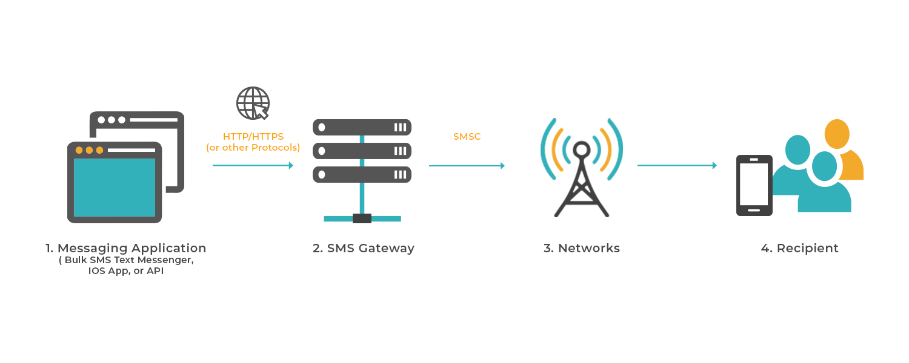

# SMS

import Tabs from '@theme/Tabs';
import TabItem from '@theme/TabItem';


The Beem SMS API has been developed to ensure a simple interface for developers whilst providing flexibility in terms of implementation, with this API you are able to send an SMS to number in more than than 22 regions and also get your delivery report.


## SMS sending Flow 




Thanks to SDK all the complex process lies underneath integration have been simplified and you can use a single method to single and multiple messages just as shown in the example below;

:::caution
I'm using have already authenticated your app with the correct *access key* and *secret key*
:::

## Example 1.0

<Tabs
  defaultValue="py"
  values={[
    { label: 'Python', value: 'py', },
    { label: 'JavaScript', value: 'js', },
    { label: 'PHP', value: 'php', },
  ]
}>

<TabItem value="py">

```py
>>> SMS.send_sms('hello pythonista', '255xxxxxxxxxx')
{'successful': True, 'request_id': 35918915, 'code': 100, 'message': 'Message Submitted Successfully', 'valid': 1, 'invalid': 0, 'duplicates': 0}
```

</TabItem>

<TabItem value="js">

```js
Not yet(maybe its waiting for you)
```

</TabItem>
<TabItem value="php">

```php
Not yet(maybe its waiting for you)
```

</TabItem>
</Tabs>


## Custom Sender ID

The above example assumes  you're using default BeemAfrica sender ID,  to change it to your own sender just do this instead;

### Example 1.1

<Tabs
  defaultValue="py"
  values={[
    { label: 'Python', value: 'py', },
    { label: 'JavaScript', value: 'js', },
    { label: 'PHP', value: 'php', },
  ]
}>

<TabItem value="py">

```py
>>> SMS.send_sms(
        'You\'re now verified',
        '255xxxxxxxxx', 
        sender_id='new-sender-id'
        )

{'successful': True, 'request_id': 35918915, 'code': 100, 'message': 'Message Submitted Successfully', 'valid': 1, 'invalid': 0, 'duplicates': 0}
```

</TabItem>

<TabItem value="js">

```js
Not yet(maybe its waiting for you)
```

</TabItem>
<TabItem value="php">

```php
Not yet(maybe its waiting for you)
```

</TabItem>
</Tabs>

## Scheduling an SMS

You can also schedule message to be sent at a certain period  in time together with a new sender ID just as shown in the example below;


### Example 1.2

<Tabs
  defaultValue="py"
  values={[
    { label: 'Python', value: 'py', },
    { label: 'JavaScript', value: 'js', },
    { label: 'PHP', value: 'php', },
  ]
}>

<TabItem value="py">

```py
>>> SMS.send_sms(
        'You have won a 10 Million', 
        '2557xxxxxxxxx', 
        sender_id='new-sender-d', 
        schedule_time='scheduled time'
    )
{'successful': True, 'request_id': 35918915, 'code': 100, 'message': 'Message Submitted Successfully', 'valid': 1, 'invalid': 0, 'duplicates': 0}
```

</TabItem>

<TabItem value="js">

```js
Not yet(maybe its waiting for you)
```

</TabItem>
<TabItem value="php">

```php
Not yet(maybe its waiting for you)
```

</TabItem>
</Tabs>

## Multiple contacts

Instead of sending an a sms one at a time, there some cases where you might wanna send a common message across a group of contacts(campaign) of which the first implementation thats comes into contacts is storing your data is a container data structure and then looping over the contacts, well thats Okay ! but it can cost you performance when the number of contacts increase.

Thats why Beem Africa also provide you built in functionality that let you specify the contacts and the common message you would like to send and then the rest will be handled by Beem Africa servers thus saving you computation resources and performance.

Here is an Example on how to actually do that in code;

### Example 1.3


<Tabs
  defaultValue="py"
  values={[
    { label: 'Python', value: 'py', },
    { label: 'JavaScript', value: 'js', },
    { label: 'PHP', value: 'php', },
  ]
}>

<TabItem value="py">

```py
>>> SMS.send_sms('my-message', ['2557xxxxxx', '2557xxxxxx'])
```

</TabItem>

<TabItem value="js">

```js
Not yet(maybe its waiting for you)
```

</TabItem>
<TabItem value="php">

```php
Not yet(maybe its waiting for you)
```

</TabItem>
</Tabs>

That's all with an SMS, I'm excited to see what you're going to build with it

:::note
incase of any issue or difficult encountred with the usage of this module, raise an issue on corresponding github repository 
:::